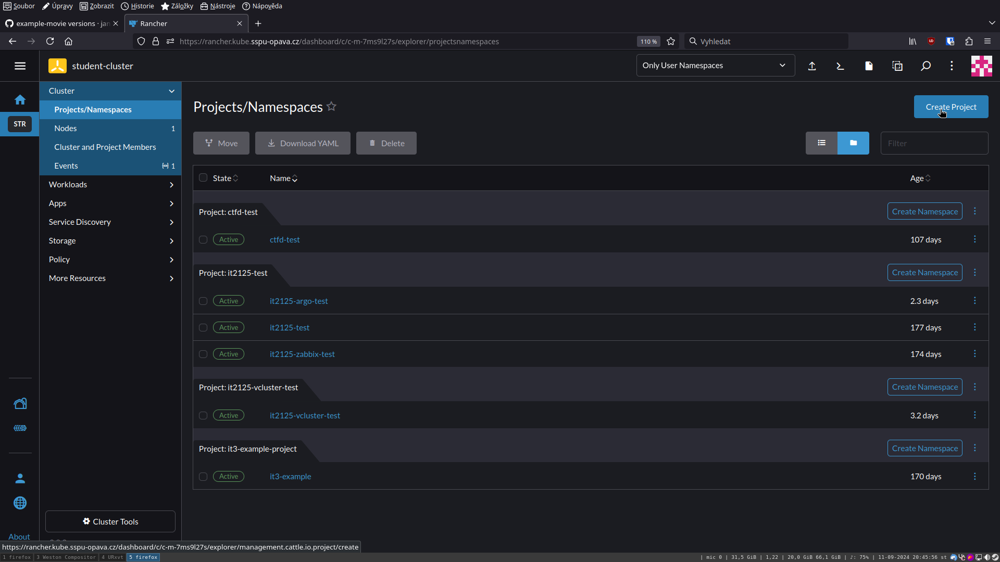
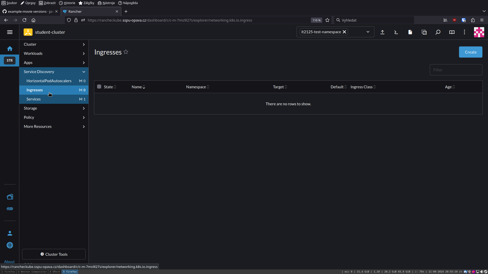

Django projekt na k8s
=====================

.. _setup:

Nastavení repozitáře
--------------------

Zaprvé, je potřeba mít funkční projekt v Djangu. Jestliže takový projekt nemáte, můžete si stáhnout ukázkový projekt pomocí nasledujících příkazů.

.. code-block:: console

   git clone https://github.com/lucny/mat_filmy.git
   cd mat_filmy
   git checkout solution

Následně budete muset vytvořit soubor ``Dockerfile`` v kořenovém adresáři projektu. Můžete použít následující kód.

.. code-block:: dockerfile

    FROM python:3.11

    WORKDIR /app
    
    COPY . /app
    
    RUN pip install --no-cache-dir -r requirements.txt
    
    EXPOSE 8000
    
    # 0.0.0.0:8000 zajistí, že server bude naslouchat na všech zařízeních, což je pro chod v containeru nutné
    CMD [ "python", "manage.py", "runserver", "0.0.0.0:8000" ] 

Tvorba image pomocí GitHub Actions
----------------------------------

Nejdříve musíte v GitHub repozitáři otevřít záložku ``Actions``.

Následně klikněte na ``Search workflows`` a vyhledejte ``Publish Docker Container``.

Klikněte na ``Configure``.

.. image:: img/github-correct-action.png
  :alt: GitHub Actions

Následně klikněte na ``Commit changes``.

Následně musíte počkat na dokončení workflow (lze poznat z barvy vedle digestu posledního commitu - zelená = vše v pořádku, červená = chyba, oranžová = probíhá).

Po dokončení workflow uvidíte vpravo v sekci ``Packages`` vytvořený image, klikněte na něj.

Následně klikněte na tag s názvem branche - standardně ``main``.

Následně zkopírujte odkaz na image - to, co lze vidět po ``docker pull``.

.. warning::
   Z příkazu **nekopírujte** ``docker pull``, ale pouze text po něm - je ve formátu ghcr.io/<username>/<repo>:<branch>.

Nastavení v Rancheru
--------------------

Nejdříve se přihlaste do `školního Rancheru <https://rancher.kube.sspu-opava.cz>`_.

Následně klikněte na ``Projects/Namespaces``.

Uvidíte seznam všech projektů, klikněte vpravo nahoře na tlačítko ``Create Project``.

Následně vyplňte název projektu a klikněte na ``Create``.

V seznamu projektů klikněte na tlačítko ``Create Namespace`` u nově vytvořeného projektu.

Následně vyplňte název namespace (může být stejný jako název projektu) a klikněte na ``Create``.

Vpravo nahoře je napsané ``Only User Namespaces``, klikněte na to.

Vyberte právě vytvořený namespace.

Klikněte na ``Workloads``.

Klikněte na ``Deployments``.

.. image:: img/rancher-deploy.png
  :alt: Rancher deployments

Klikněte na ``Create``.

Vyplňte název deploymentu a do sekce ``Container Image`` vložte odkaz na image, který jste si zkopírovali dříve (formát ghcr.io/<username>/<repo>:<branch>).

V sekci ``Networking`` klikněte na ``Add Port or Service``. Jakožto ``Service Type`` vyberte ``Cluster IP``, napište jméno a vyplňte port v containeru - při použití úkazkového souboru Dockerfile ``8000``.

Klikněte na ``Create``.

Klikněte na ``Service Discovery``.

Klikněte na ``Ingresses`` a následně na tlačítko ``Create``.

Vyplňte název a do ``Request Host`` vpište požadovanou URL - **musí** být ve formátu ``<cokoliv>.kube.sspu-opava.cz``. V sekci ``Path`` vyberte ``Prefix``, do ``Path`` napište ``/`` a v sekci ``Target Service`` vyberte Vámi vytvořenou službu, následně vyberte port.

Nyní počkejte 2-5 minut na dokončení vytvoření Ingressu.

Nyní můžete projekt naleznout na URL, kterou jste si zvolili.

.. image:: img/k8s-final.png
  :alt: K8s final

